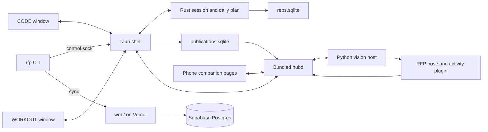

# RFP architecture as built

Reviewed against source on 2026-09-30. Intended behavior lives in
[design](../design/index.md); operating instructions live in the [wiki](../wiki/index.md).

## Source boundaries

| Component | Implementation and responsibility |
|---|---|
| Desktop | [lib.rs](../../app/src-tauri/src/lib.rs), [runtime.rs](../../app/src-tauri/src/runtime.rs): commands, mode isolation, routine loading and resource lookup |
| Windows | [windows.rs](../../app/src-tauri/src/windows.rs), [x11_windows.py](../../app/src-tauri/src/x11_windows.py): the `main` (CODE) and `gym` (WORKOUT) windows, fullscreen/monitor placement, and minimizing and restoring other X11 apps |
| Daily and agents | [daily.rs](../../app/src-tauri/src/daily.rs), [activity.rs](../../app/src-tauri/engine/src/activity.rs): single-instance lock, work minutes (default 25), snooze, Claude Code / Codex process detection that pauses the countdown, workday-end warning |
| Control socket | [control.rs](../../app/src-tauri/src/control.rs): Unix socket `control.sock` in the data directory. It rejects paths over the 108-byte limit and refuses to turn lock mode on |
| CLI | [reps-cli](../../app/src-tauri/reps-cli/src/main.rs): binary `reps`, installed as both `rfp` and `reps`. It drives the running app (start/finish/cancel/snooze/skip, settings, routine, show/hide, display, camera, debug, mode, service), reads local or remote history, syncs, and manages the site profile |
| Session | [engine](../../app/src-tauri/engine/src/session.rs): Coding → ExerciseRequired → WorkoutActive → WeightConfirmation → Unlocked; daily-plan completion suppresses further prompts |
| Daily plan | [plan.rs](../../app/src-tauri/engine/src/plan.rs): routine prescription and per-day completion |
| Local storage | [store.rs](../../app/src-tauri/engine/src/store.rs): settings, rotation, pointer state, exercise history, `routine_days` and `destination_uploads` in SQLite |
| Data directory | `app_home()` in [activity.rs](../../app/src-tauri/engine/src/activity.rs): `~/.local/share/rfp`, with a one-time rename from `reps-for-claude/`. `REPS_APP_HOME` overrides it |
| Hub boundary | [hub.rs](../../app/src-tauri/src/hub.rs), [client](../../app/src-tauri/hub-client/src/client.rs), [supervisor](../../app/src-tauri/hub-client/src/supervisor.rs): metric lifecycle, session identity, owned process lifecycle, and fallback. Start retries with backoff from 0.5 s to 30 s, and the last failure is reported by `rfp camera status` (PR #13) |
| Publication recovery | [outbox.rs](../../app/src-tauri/hub-client/src/outbox.rs): durable FIFO queue, stable IDs, retry after acknowledgement loss |
| Vision | [Detection architecture](detection.md): legacy presets, versioned movements, jump rope and stretch. [Consensus](consensus.md): multi-camera and phone |
| Packaging | [bundle-hub.sh](../../scripts/bundle-hub.sh): staged hub, plugin, model and consumer artifacts; [package evidence](../production/package-verification.md) |
| Install | [install-dogfood.py](../../scripts/install-dogfood.py): `~/.local/lib/rfp`, the `rfp.service` systemd user unit, and a login autostart entry |

The app has no tray icon. Tauri's `tray-icon` feature is enabled, but nothing
creates a tray.

## Design coverage and remaining work

Requirements: [production target](../../../usb-mcp-hub/docs/design/production-target.md).

| Requirement | As built | Evidence / remaining gap |
|---|---|---|
| App owns workouts; hub is generic | Hub-free engine plus Rust hub-client and external RFP plugin | Source boundaries above |
| Demonstrate → evaluate → activate | Studio manages candidates; desktop supplies movement ID and pins active rules at enable time | [Movement guide](../production/movement-studio.md); real-gym qualification remains pending |
| Noise-resistant rep detection | Temporal phases for versions; two thresholds for legacy presets | [Detection](detection.md); preset tuning is not an accuracy claim |
| Durable lifecycle publication | Desktop outbox retries stable event/command/result IDs | [Recovery guide](../production/movement-studio.md#publication-recovery); local state change and enqueue are not one transaction |
| Safe failure and release operation | Debug isolation, honor fallback, hub start retry, owned-child cleanup | [Target-machine checklist](../checklists/e2e-target-machine.md); physical failure tests and soak still required |
| Accurate, responsive camera operation | Automated software/video checks exist | [Readiness evidence](../production/software-readiness.md); gym accuracy and actual display latency remain release gates |

This page describes source behavior. It does not assert that a previously built
installer contains subsequent source changes.

## Web site

`web/` is a Next.js app deployed to Vercel from the CLI. It stores data in
Supabase Postgres through the least-privilege `rfp_web` runtime role. Five
migrations under `web/supabase/migrations/` add usage guards, the runtime role,
profile settings, opt-in location and routine progress.

- **Public:** anonymous structured activity posts, cheers, reports, separate
  email capture, and a guest showcase of rotating 28-day heatmaps. Demo profiles
  are labeled DEMO.
- **Private:** a versioned bearer-token API at `/api/v1/{history,summary,status,sync}`,
  used by `rfp sync`, `rfp profile` and `rfp history --source remote`.
- **Publishing rules:** posts require `sharing` on; they are deduplicated
  (`destination_uploads`) and capped at six per rolling hour.

Operating details: [dogfood setup and limits](../production/rfp-dogfood.md).

## Known gaps

- **Vision accuracy.** Lifts still use the legacy counter. Stretch is a timer
  and jump rope counts motion seconds, not jumps. There is no evaluation harness
  yet. See the roadmap in `../REPORT.md` §8 (workspace root).
- **Manual verification.** The hands-and-eyes items listed at the end of
  [rfp-dogfood.md](../production/rfp-dogfood.md) are still outstanding.
